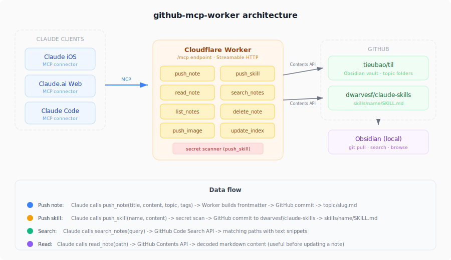

# github-mcp-worker

A Cloudflare Worker that acts as a remote MCP server for pushing knowledge notes to a GitHub repository. The target repo is an Obsidian vault organized by topic. Built to close the iOS gap in a personal knowledge management pipeline.

## Why

Claude on macOS can push files to GitHub via bash. Claude on iOS cannot. This Worker bridges that gap by exposing MCP tools that Claude iOS can call as a cloud connector.

## How it works



## Tools

| Tool | Description |
|------|-------------|
| `push_note` | Push a markdown note with frontmatter to `{topic}/{slug}.md` |
| `push_skill` | Push a SKILL.md (+ extra files) to `dwarvesf/claude-skills` with secret scanning |
| `push_image` | Push a base64 image to `assets/{topic}/{slug}.ext` |
| `read_note` | Fetch a note's content by path (for review before updating) |
| `search_notes` | Keyword search across notes via GitHub Code Search API |
| `list_notes` | List notes from the repo, optionally filtered by topic |
| `delete_note` | Delete a note by path |
| `update_index` | Rebuild `README.md` with an auto-generated index grouped by topic |

## Vault structure

```
mcp/
  streamable-http-transport.md
  server-sent-events-deprecated.md
cloudflare/
  workers-secrets-management.md
assets/
  mcp/
    architecture-diagram.png
README.md   ← auto-generated index
```

## Setup

```bash
npm install
npx wrangler deploy

# Required secrets
npx wrangler secret put GITHUB_PAT    # GitHub PAT with repo scope
npx wrangler secret put GITHUB_OWNER  # Your GitHub username
npx wrangler secret put GITHUB_REPO   # Target repo name (e.g., "learned")

# Optional
npx wrangler secret put AUTH_TOKEN    # Bearer token for abuse prevention
```

Then add `https://github-mcp-worker.<subdomain>.workers.dev/mcp` as a custom connector in Claude.ai Settings > Connectors.

## Local development

```bash
npx wrangler dev
# Test at http://localhost:8787/mcp with MCP Inspector
```

## Tests

```bash
npm test          # vitest run (32 tests)
npm run test:watch  # vitest watch mode
```

Covers slug generation and secret scanning (detection + false positive handling).

## Tech stack

- **Runtime**: Cloudflare Workers
- **MCP transport**: Streamable HTTP via `@cloudflare/agents`
- **Auth**: Authless MCP + optional bearer token
- **Storage**: GitHub Contents API (PAT as Worker secret)
